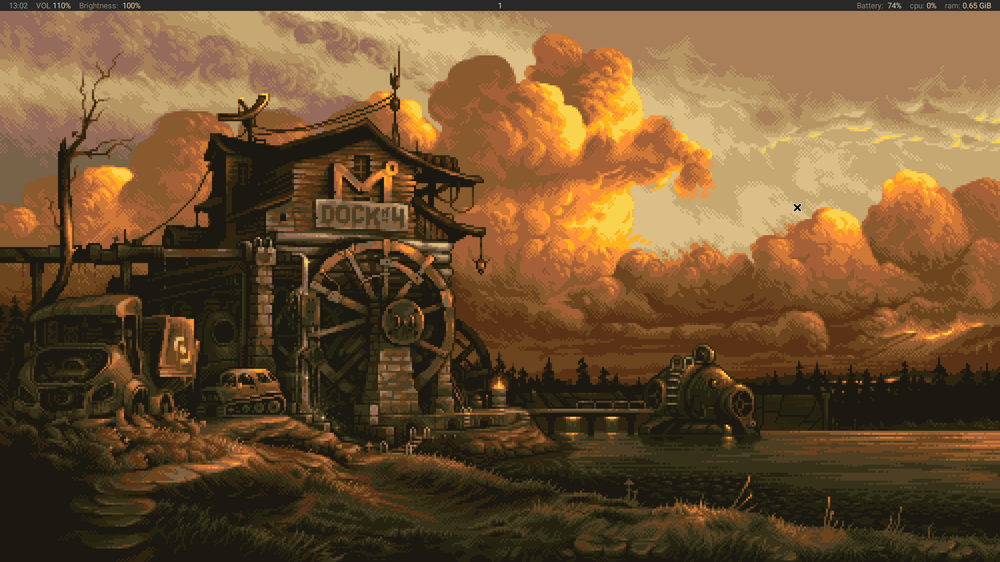

# Theion's dot files.

<!-- ## Gruvbox themed Bspwm config for: -->

<!-- * Bspwm -->
<!-- * Sxhkd -->
<!-- * Kitty -->
<!-- * Alacritty -->
<!-- * Picom -->
<!-- * Polybar -->
<!-- * Zsh -->
<!-- * Additional HQ gruvbox wallpapers -->

<!-- Image -->
## Screenshots


## Installation
It is always a good idea to make a backup of your current config.

1. Clone this repository. 
```
git clone https://github.com/thei0n/config
```

2. Change direcotry to this repo.
```
cd config
```


3. Move the zshrc file .zshrc. 
```
mv zsh/zshrc ~/.zshrc

```

4. Move all the directories to your .config directory. 
```
mv * ~/.config

```

## Notes

* In order for nvim to work properly packer must be installed.
* For some reason there must be nvim/lua/{init.lua,mason.lua} files for lsp to work properly, but I have no idea why


