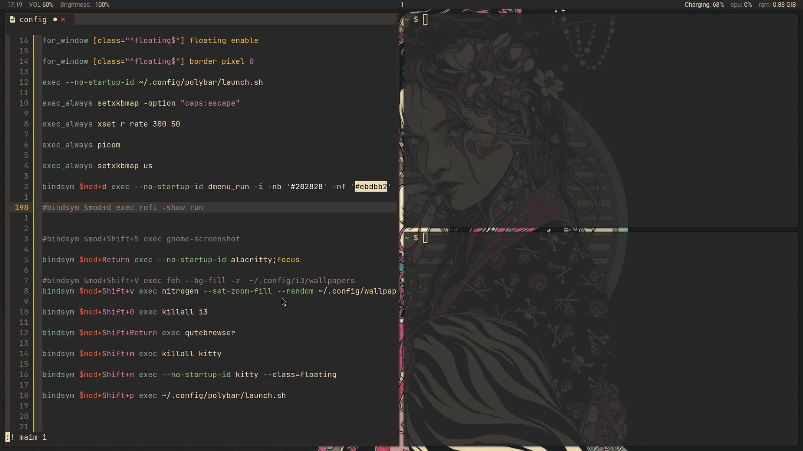

# Theion's dot files.

## Gruvbox themed i3-wm config for:

* i3-wm
* Kitty
* Alacritty
* Picom
* Polybar 
* Zsh
* Additional HQ gruvbox wallpapers

## Screenshots


## Installation
It is always a good idea to make a backup of your current config

1. Clone this repository.
```
git clone https://github.com/thei0n/config
```

1. Change directory to this repo.
```
cd config
```

1. Move the zshrc file to ~/.zshrc .
```
mv zsh/zshrc ~/.zshrc
```

1. Move all the other directories to your .config directory.
```
mv * ~/.config
```

## Notes
Picom config is nothing other than what comes out of the box when you install picom.
And what you see on the screenshot is gruvbox themed [AstroNvim](https://github.com/AstroNvim/AstroNvim).
